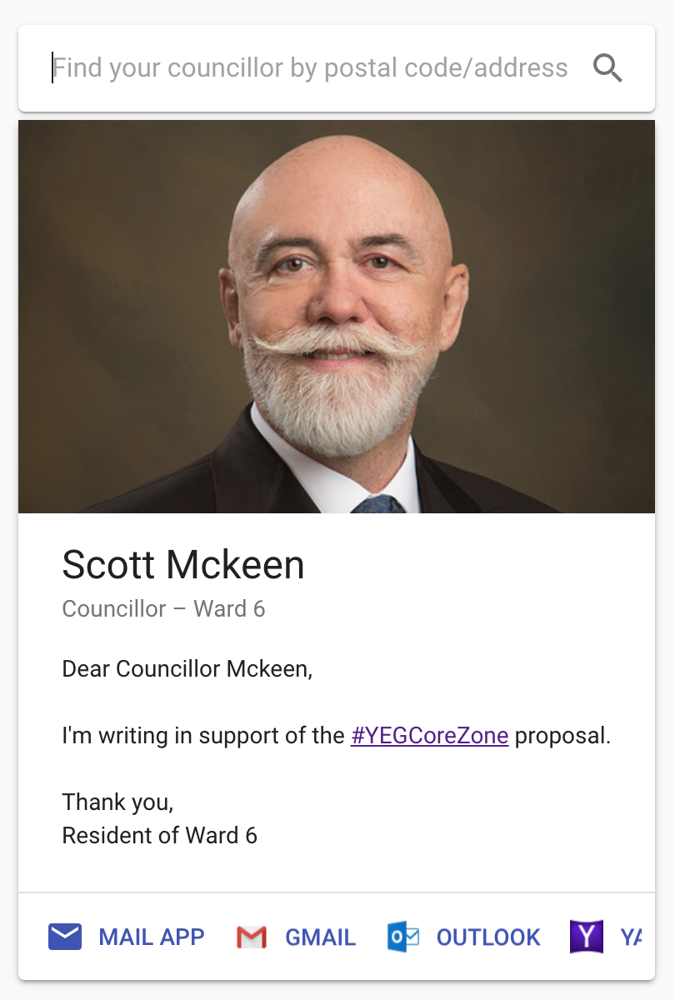

# email-contact

Find your Edmonton City Councillor and auto-fills an email template: https://edmondchuihw.github.io/email-contact

## Featured in _Joyful React Testing_  

[Video](https://www.youtube.com/watch?v=R8yX1tCDQIs) | [Resources](https://bit.ly/joyful-react-testing)

## λ
* Uses [Ramda](https://ramdajs.com/) for functional programming where applicable.  
* Pure/Dumb/Presentational components are favoured.  
* All React components are functional – no classes!

  
  
  

## Tests
### `test:units`
Runs unit tests in watch mode. Does not require backend to be running.

### `test:e2e:watch`
Opens Cypress for running e2e/integration/acceptance/Clicky-McClick tests. Expects local app to be reachable

### `test`
Runs all unit tests and Clicky-McClick tests. Expects local app to be reachable

### `test:ci`
Runs all unit tests and Clicky-McClick tests. Starts local app automatically. Defaults to use production backend server.

## Continuous Integration (CI)
Project is automatically deployed if all tests pass.  
View the Azure Pipeline project: https://dev.azure.com/chuihinwai/email-contact

## Backend
See [address2contact](https://github.com/chuihinwai/address2contact). Also uses [Ramda](https://ramdajs.com/) extensively.

## Todo
- [ ] Use tagged template strings for links in email body
- [ ] Only prompt for location when clicked on a "locate me" button
- [ ] Add privacy policy (location is not stored on our server, email content is not tracked, etc.)
- [ ] Add "ask your friends to send an email too" with socials after returning from clicking an email button
- [ ] E2E test view ports, location prompt, etc.
- [ ] Add better way to run E2E test with local server
- [ ] Improve server/network failure handling
- [ ] Add config file instead of calling inline `process.env.`

## Defaults

This project was bootstrapped with [Create React App](https://github.com/facebook/create-react-app).

## Available Scripts

In the project directory, you can run:

### `npm start`

Runs the app in the development mode. 
Open [http://localhost:3000](http://localhost:3000) to view it in the browser.

The page will reload if you make edits. 
You will also see any lint errors in the console.

### `npm test`

Launches the test runner in the interactive watch mode. 
See the section about [running tests](https://facebook.github.io/create-react-app/docs/running-tests) for more information.

### `npm run build`

Builds the app for production to the `build` folder. 
It correctly bundles React in production mode and optimizes the build for the best performance.

The build is minified and the filenames include the hashes. 
Your app is ready to be deployed!

See the section about [deployment](https://facebook.github.io/create-react-app/docs/deployment) for more information.

### `npm run eject`

**Note: this is a one-way operation. Once you `eject`, you can’t go back!**

If you aren’t satisfied with the build tool and configuration choices, you can `eject` at any time. This command will remove the single build dependency from your project.

Instead, it will copy all the configuration files and the transitive dependencies (Webpack, Babel, ESLint, etc) right into your project so you have full control over them. All of the commands except `eject` will still work, but they will point to the copied scripts so you can tweak them. At this point you’re on your own.

You don’t have to ever use `eject`. The curated feature set is suitable for small and middle deployments, and you shouldn’t feel obligated to use this feature. However we understand that this tool wouldn’t be useful if you couldn’t customize it when you are ready for it.

## Learn More

You can learn more in the [Create React App documentation](https://facebook.github.io/create-react-app/docs/getting-started).

To learn React, check out the [React documentation](https://reactjs.org/).

### Code Splitting

This section has moved here: https://facebook.github.io/create-react-app/docs/code-splitting

### Analyzing the Bundle Size

This section has moved here: https://facebook.github.io/create-react-app/docs/analyzing-the-bundle-size

### Making a Progressive Web App

This section has moved here: https://facebook.github.io/create-react-app/docs/making-a-progressive-web-app

### Advanced Configuration

This section has moved here: https://facebook.github.io/create-react-app/docs/advanced-configuration

### Deployment

This section has moved here: https://facebook.github.io/create-react-app/docs/deployment

### `npm run build` fails to minify

This section has moved here: https://facebook.github.io/create-react-app/docs/troubleshooting#npm-run-build-fails-to-minify
